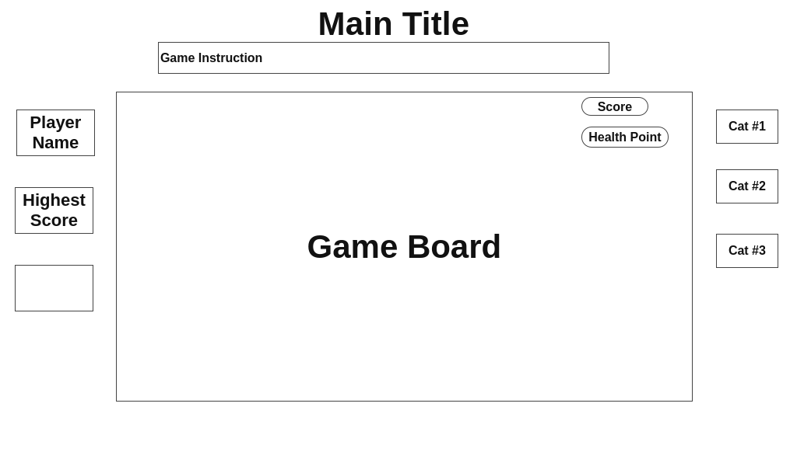

# Cat_Game_Final_Proposal

# **Cat Game**

## **Background**

Cat game is a jumping game for a single player to make a cat jump. There will be different cats that can be chosen to play with. Players can use the keyboard to make the cat jump and avoid obstacles to achieve a higher score. Each time the cat hits the obstacles it will reduce 1 health point. Game will end if the health point is equal to 0.
The cat will get 1 health point if it eats one cat food which will appear randomly. 

## **Functionality & MVPs**

**In Cat Game, users will be able to:**

- Use mouse and keyboard to play the game
- Choose a different cat
- Make the cat jump over and avoid obstacles to achieve a higher score.
- See the live score and health points

**In addition, this project will include:**

- A game instruction to explain the rules and how to play the game.
- A production README

## **Wireframes**

## **Technologies, Libraries, APIs**

​​This project will be implemented with the following technologies:
The Canvas library
- Gif
- JavaScript
- Rails

## **Implementation Timeline**

**Friday Afternoon & Weekend:** Setup project, including getting webpack up and running. Setup the canvas and get canvas to show up on the screen, and spend time getting comfortable with the Canvas API. And make basic movements.

**Monday:** Make the jump function

**Tuesday:** Render graphics and CSS to setup style.

**Wednesday:** Continue with jump function and render graphics and hit box.

**Thursday:** Upload to gitHub pages.

## **Bonus Features:**

- palyer resgistration.
- record and show the highest score of all the players.
- cat can eat food to restore health point.

